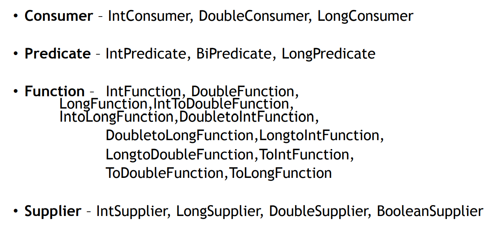
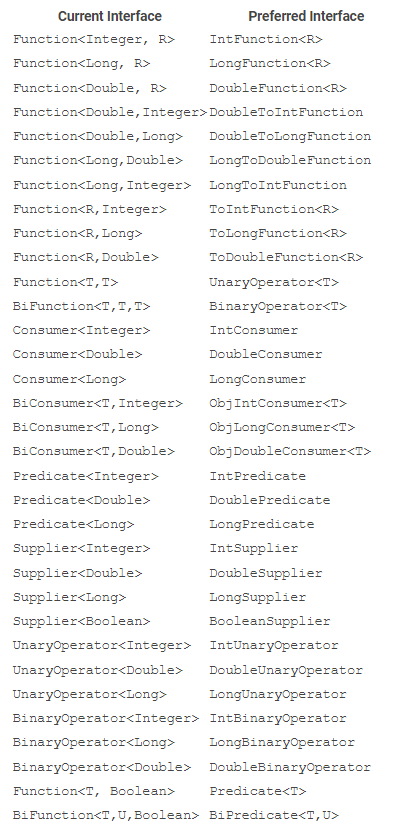
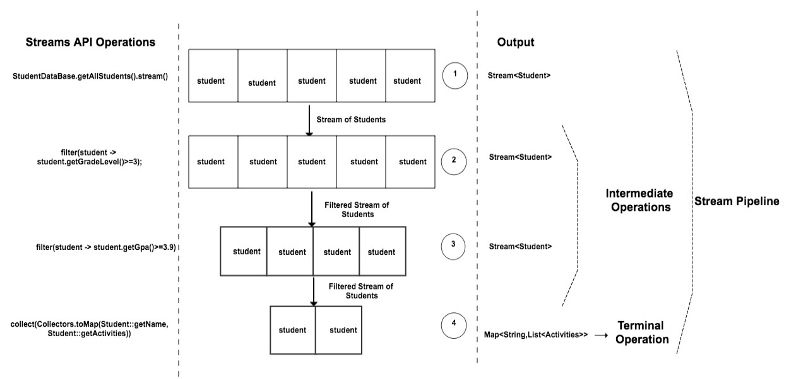
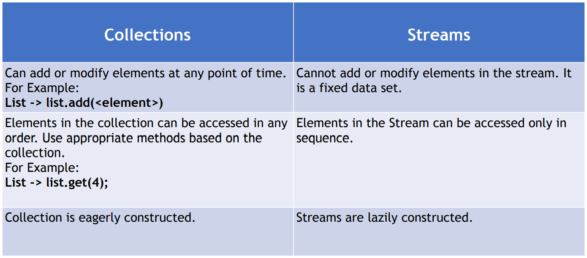
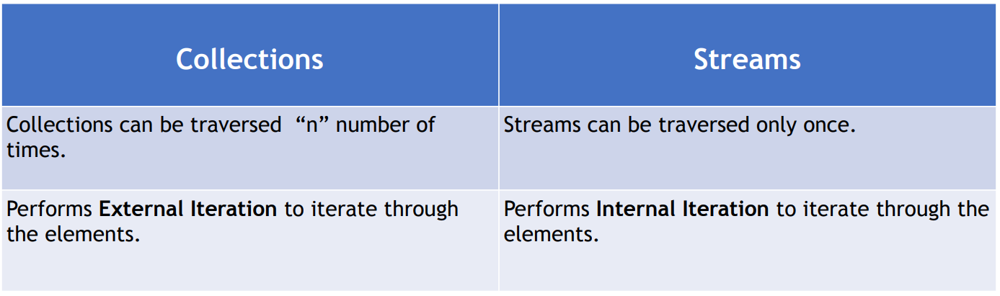
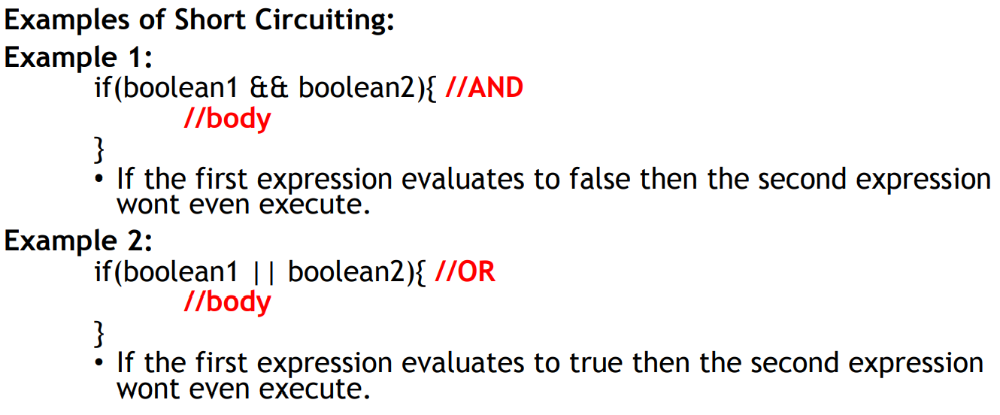
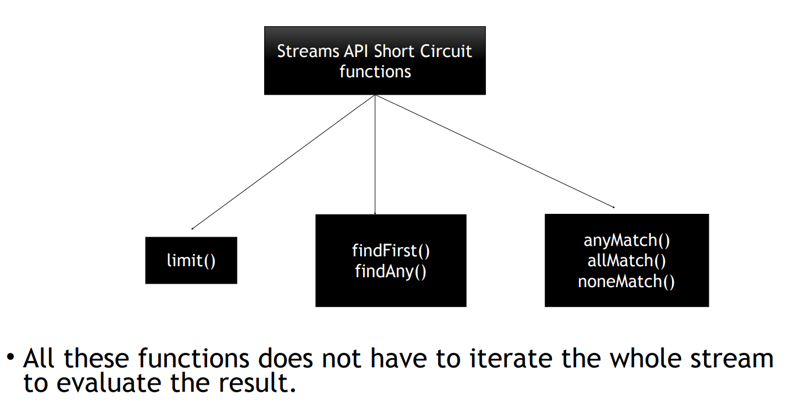
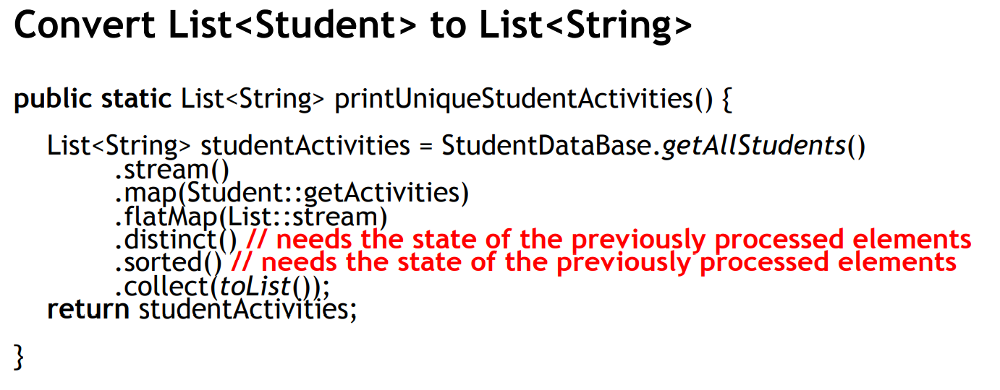
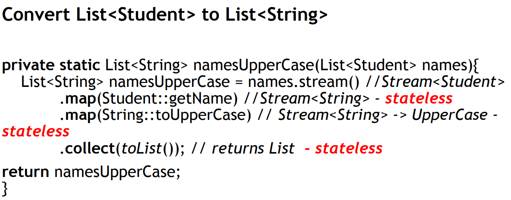

## Java 8 Modern Programming
### Why Java 8?
1) Needed Java 8 for functional programming features such as Lambdas, Streams, Optionals etc.
2) Also helps in parallel programming, prior to Java 8 we need to use threads for achieving parallel programming but dealing with threads is tricky and risky.
3) With Java8 we will be able to write the functional programming code using the new functional concepts which is going to help you simplify the concurrency operations which will make use of the multiple processors whenever needed.
4) Supports creating immutable objects, which will help in solving a lot of issues in Java application because of the objects states getting changed.
5) More concise and readable code.
6) In Java 8, with functional programming we can create a function and assign that functionality to a variable and pass it around as like method parameters.
7) With Java 8, we can write the code in declarative way instead of imperative way.

### Imperative vs Declarative ways of programming
**Imperative Style of Programming**
1) Focuses on how to perform the operations. 
2) Embraces Object mutability. 
3) This style of programming lists the step by step of instructions on how
to achieve an objective. 
4) We write the code on what needs to be done in each step. 
5) Imperative style is used with classic Object-Oriented Programming.

**Declarative Style of Programming**
1) Focuses on what is the result you want. 
2) Embraces Object immutability. 
3) Analogous to SQL (Structured Query Language). Similar to SQL where we just retrieve data from without bothering about how it is done, functional programming also uses the same idea. Focuses on the result.
4) Use the functions that are already part of the library to achieve an
objective. 
5) Functional Programming uses the concept of declarative programming.

### What is Lambda Expression?
1) Lambda is equivalent to a function (method) without a name. 
2) Lambdas are also referred as Anonymous functions that has.

    • Method parameters

    • Method Body

    • Return Type 

3) Lambdas are not tied to any class like a regular method. 
4) Lambda can also be assigned to variable and passed around.
5) Lambda is mainly used to implement Functional Interfaces (SAM: Single Abstract Method).

### Functional Interfaces
1) Functional interface is an interface that has exactly one abstract method.
2) @FunctionalInterface is an annotation introduced in java 8. And all the interfaces which has one abstract method are annotated with @FunctionalInterface. 
3) This is an optional annotation, but it does validate the interfaces that are annotated with this @FunctionalInterface to make sure that the interfaces are not breaking the contract meaning it mandates the interface to have only one abstract method.
4) New functional interfaces in Java 8, with their extensions:

   • Consumer – BiConsumer
   
   • Predicate - BiPredicate
   
   • Function – BiFunction, UnaryOperator, BinaryOperator

   • Supplier
5) All these interfaces are present in java.util.function package.

#### Consumer Functional Interface
It has one method called "accept with return type as void", which takes one input and works on it. It has a default function "andThen" which is sequential call to the accept function.
If performing this operation throws an exception, the after operation will not be performed.

Params: after – the operation to perform after this operation

Returns: a composed Consumer that performs in sequence this operation followed by the after operation.

#### Bi Consumer Functional Interface
Represents an operation that accepts two input arguments and returns no result. This is the two-arity specialization of Consumer.

If we have two variables and both can be combined, then instead of creating to separate consumers for both variables better create one BiConsumer.

If there is value to have separate consumers for each, we can use that too. No performance benefits of BiConsumer over Consumer.

#### Predicate Functional Interface
It has a single abstract method called "test", which accepts an input, perform some operation and returns boolean.

It has 3 default functions: And, Or, Negate. These are used to perform logical boolean operations.

Also, it has 2 static functions: isEqual and not.

#### Bi Predicate Functional Interface
Represents a predicate (boolean-valued function) of two arguments. This is the two-arity specialization of Predicate.
Evaluates the input and returns boolean based on the input arguments matching the predicate conditions.

#### Function Functional Interface
Function in Java is nothing but a method in a class.

So using function interface, we can implement a functionality as like we call a method in Java and assign that functionality to a variable.

Really new concept, never possible before JAVA 8.

It has one abstract method called "apply", It takes an input and applies this function to that input.

It has two default methods "compose" and "andThen".

#### Bi Function Functional Interface
Represents a function that accepts two arguments and produces a result. This is the two-arity specialization of Function.

This is a functional interface whose functional method is "apply(Object, Object)".

It has one default method "andThen". It accepts a Function as a parameter, i.e. accepts output of caller function as
input and performs operation on it and returns the required output.

#### Unary Operator Functional Interface
It extends Function Functional Interface.

Since we have Function Functional Interface, then in case we have same input and output type then we can use Unary
Operator Functional Interface instead of a Function.

#### Binary Operator Functional Interface
It extends BiFunction Functional Interface.

Since we have BiFunction Functional Interface, then in case we have same inputs and output type then we can use Binary
Operator Functional Interface instead of a BiFunction.

#### Supplier Functional Interface
Opposite of Consumer Functional Interface. Takes on input and returns an output to the caller.

It has one abstract method called "get".

### Primitive Functional Interfaces

### Current VS Preferred Functional Interface

## Method Reference
Introduced as part of Java 8 and its purpose is to simplify the implementation of Functional Interfaces.

We have achieved it using Lambda, it helped us move away from creating anonymous inner classes.
But Method Reference is used to simplify the lambda expression itself.

Method Reference is shortcut of writing Lambda Expressions.

#### Syntax of method reference
ClassName::instance-methodName

ClassName::static-methodName

Instance::methodName

#### Where to use method reference
Lambda expressions referring to a method directly.

Using Lambda:
Function<String,String> toUpperCaseLambda = (s)->s.toUpperCase();

Using Method Reference, it is simpler and more readable code:
Function<String,String> toUpperCaseMethodReference = String::toUpperCase;

#### Where better not to use method reference
Predicate<Student> predicateUsingLambda = (s) -> s.getGradeLevel()>=3;

Here, we have our own logic and no method is directly referred. So it's difficult to write method reference in such use cases.

## Constructor Reference
Introduced in Java 8.

Syntax:  Classname::new

We can only use Constructor Reference in context of Functional Interfaces

Example: Supplier<Student> studentSupplier = Student::new;

This returns a new Student object whenever Supplier get method is called. Exception is Student class should have default constructor only.

Invalid: Student student = Student::new; // compilation issue

## Lambdas and Local Variables
###What is a Local variable ?
Any variable that is declared inside a method is called a local variable.

Lambdas have some restrictions on using local variables:

• Not allowed to use the same the local variable name as lambda parameters or inside the lambda body.

• Not allowed re-assign a value to a local variable. No restrictions on instance/class variables.

## Effectively Final
Lambdas are allowed to use local variables but not allowed to modify it even though they are not declared final.
This concept is called Effectively Final. 

Not allowed to modify the value inside the lambda:

int value =4; // local variable

Consumer<Integer> c1 = (a) -> {

//value=6; //reassigning not allowed

// System.out.println(i+value);

};

Prior to Java 8 , any variable that’s used inside the anonymous class should be declared final.

### Advantages of Effectively Final:
• Easy to perform concurrency operations.

• Promotes Functional Programming and demotes the Imperative style programming.

## Introduction to Streams API:
• Introduced as part of Java8

• Main purpose is to perform some Operation on Collections.

• Parallel operations are easy to perform with Streams API without having to spawn a multiple threads.

• Streams API can be also used with arrays or any kind of I/O .

## What is a Stream ?
• Stream is a sequence of elements which can be created out of a collections such as List or Arrays or any kind of I/O resources etc.,

List<String> names = Arrays.asList("adam","dan","jenny");

names.stream(); // creates a stream

• Stream operations can be performed either sequentially or parallel.

names.parallelStream(); // creates a parallel stream

Streams API manipulates the collections in declarative way, it means instead of writing the code on how to implement the
logic, just ask for the desired result using the functions that are already part of Streams API.

## How Stream API works

Map<String, List<String>> studentMapWithTwoFilters = StudentDatabase.getAllStudents().stream()

.filter(PredicateStudentExample.gradeLevelPredicate)

.filter(PredicateStudentExample.gpaPredicate)

.collect(Collectors.toMap(Student::getName, Student::getActivities));

stream() returns a stream of students which will then sequentially one by one goes to the filter method.
All the students which passes the filter are passed to next filter.
Again same thing happens, one by one student is passed to next filter and all the students which passes this filter
will create a stream and will pass to terminal operation. 
Each method which is in between stream and collect are called intermediate operations.
This final stream then goes to collect which is a terminal operation and creates the final Map which is the desired output.

**Stream is passing the elements from the top to the bottom, one by one, 
and it is updating the filter on the elements one by one.**

The collect method is a one which converts the stream to the final desired output, which we are looking for here.

We have used collectors to map which convert the stream to map.

The key highlight is terminal operation "collect" is the one which starts the stream pipeline.

If the collect method wasn't there, then there is no way this pipeline would have started, and it wouldn't have created the output.
All the other above stream operations won't happen at all.

**Terminal Operations are the one which starts the whole process. So Streams are lazy no intermediate operation will be 
invoked until the terminal operation invokes.**

## Collections VS Streams

### Stream API: map()
Converts/Transforms one type of stream into another. It is different from Map in collections framework.

### Stream API: flatMap()
flatMap : Converts(Transforms) one type to another as like map() method.

Used in the context of Stream where each element in the stream represents multiple elements.
Like: Stream<List>

### Stream API – distinct() , count() and sorted()
distinct – Returns a stream with unique elements

count – Returns a long with the total no of elements in the Stream.

sorted - Sort the elements in the stream

### Stream API – filter()
filter – filters the elements in the stream.

Input to the filter is a Predicate Functional Interface.

### Streams API - reduce()
reduce – This is a terminal operation. Used to reduce the contents of a stream to a single value.

It takes two parameters as an input.

• First parameters – default or initial value

• Second Parameter – BinaryOperator<T>

### Stream API : Max/Min using reduce()
• max -> Maximum(largest) element in the stream.

• min -> Minimum(smallest) element in the stream.

### Stream API : limit() and skip()
These two function helps to create a sub-stream.

• limit(n) – limits the “n” numbers of elements to be processed in the stream. Process the first n elements from the stream.

• skip(n) – skips the “n” number of elements from the stream. Skips the first n elements from stream.

### Streams API : anyMatch(), allMatch(), noneMatch()
All these functions takes in a predicate as an input and returns a Boolean as an output.

• anyMatch()- Returns true if any one of the element matches the predicate, otherwise false.

• allMatch() - Returns true if all the element in the stream matches the predicate, otherwise false.

• noneMatch() – Just opposite to allMatch(). Returns true if none of the element in the stream matches the predicate, otherwise false.

### Streams API : findFirst() and findAny()
Used to find an element in the stream. Both the functions returns the result of type Optional.

• findFirst() – Returns first element in the stream. Once found, rest of the stream is not processed.

• findAny() – Returns the first encountered element in the stream. Once found, rest of the stream is not processed.

**In Parallel streams findFirst and findAny will make a difference.**

**Difference between allMatch/anyMatch/noneMatch and findAny/findFirst is, allMatch/anyMatch/noneMatch returns a boolean
if particular element is present in stream. Whereas findAny/findFirst returns the element itself.**

## Short Circuiting

## Stateful and Stateless Functions
Does Streams have an internal state?

• Yes

Does all the Stream functions maintain an internal state ?

• No

### Streams API – of(), iterate() and generate()
We can use these methods whenever we need an on demand stream.

Of() -> Creates a stream of certain values passed to this method.

Example: Stream<String> stringStream = Stream.of(“adam”,”dan”,”Julie”);

iterate(), generate() -> Used to create infinite Streams.

Example: Stream.iterate(1, x->x*2) // takes two arguments, initial value and function to perform on the value each time it is called.
// this will generate infinite stream of 1, 2, 4, 8, ...

Example: Stream.generate(<Supplier>)

## Numeric Streams
Represents the primitive values in a stream. Three Types: IntStream, LongStream, DoubleStream

### Numeric Stream Ranges:
#### Int Stream:
IntStream.range(1,50) -> Returns an IntStream of 49 elements from 1 to 49.

IntStream.rangeClosed(1,50) -> Returns an IntStream of 50 elements from 1 to 50.

#### Long Stream:
LongStream.range(1,50) -> Returns a LongStream of 49 elements from 1 to 49.

LongStream.rangeClosed(1,50) -> Returns a LongStream of 50 elements from 1 to 50.

#### DoubleStream:
It does not support the range ()and rangeClosed()

### Numeric Stream – Aggregate Functions
• sum() • max() • min() • average()

### Numeric Streams : Boxing() and UnBoxing()
Boxing():
• Converting a primitive type to Wrapper Class type

Example:
• Converting an int (primitive) to Integer(wrapper).

UnBoxing():
• Converting a Wrapper Class type to primitive type.

Example:
• Converting an Integer(wrapper) to int(primitive).

### Numeric Streams – mapToObj(), mapToLong(), mapToDouble()
• mapToObj –> Convert each element in numeric stream to some Object.

• mapToLong –> Convert a numeric stream to a Long Stream.

• mapToDouble –> Convert a numeric stream to a Double Stream.
